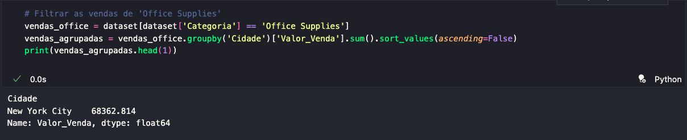
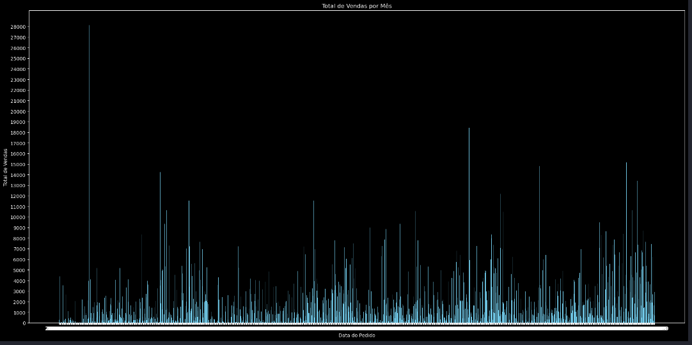
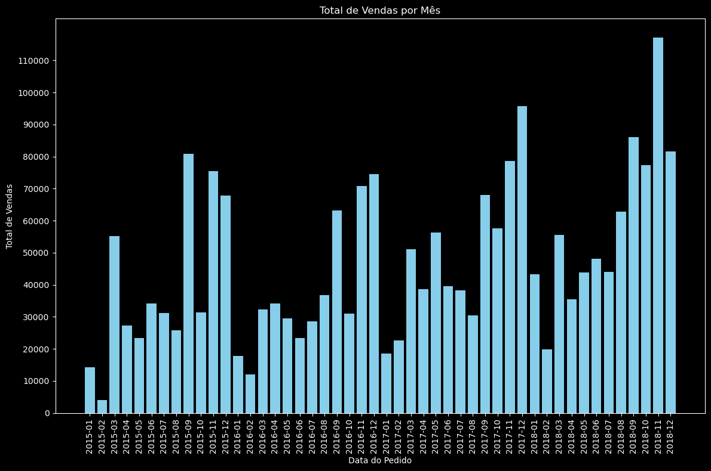
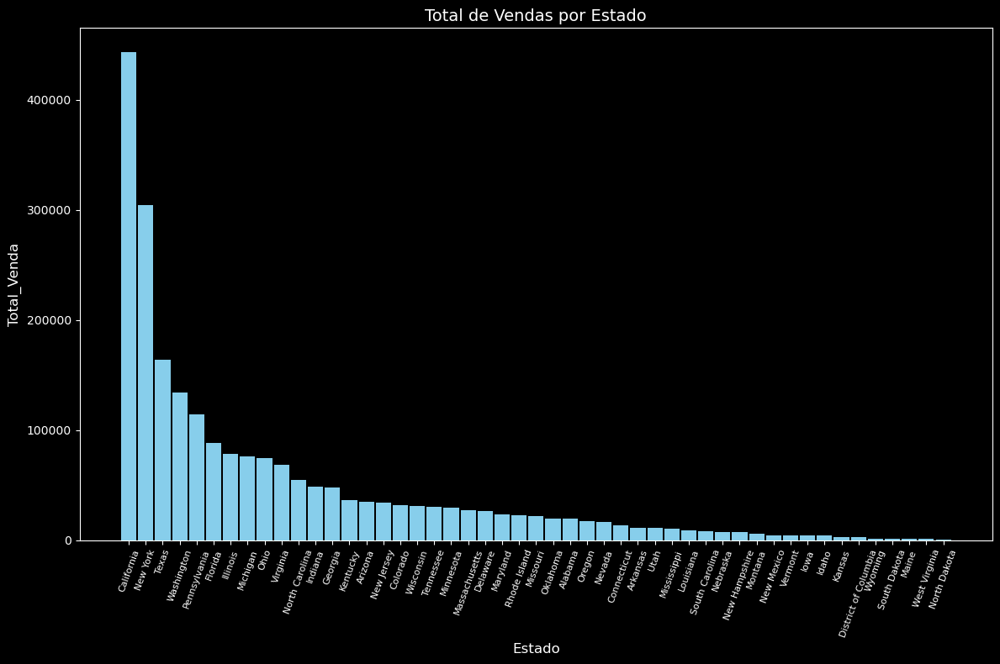
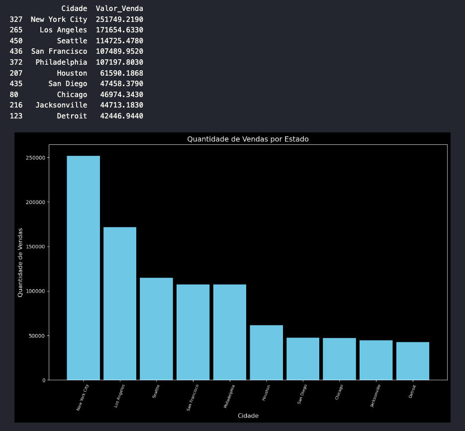

<h1> Análise Exploratória </h1>

Projeto 2 do curso "Fundamentos de Linguagem Python para Análise de Dados e Data Science" da Data Science Academy.

<h2>Introdução</h2>

A análise exploratória de dados (EDA) é uma abordagem utilizada para resumir as principais características de um conjunto de dados, frequentemente com o auxílio de métodos visuais. O objetivo da EDA é entender a estrutura dos dados, identificar padrões, detectar anomalias, testar hipóteses e verificar suposições. Esse processo é essencial para preparar os dados para modelagem e para obter insights valiosos que possam orientar decisões e estratégias.

Foram elaboradas 10 perguntas para a realização deste projeto. A seguir, exploraremos cada uma delas.

<h2>Pacotes</h2>

|Bibliotecas              | Explicação                 |
|-------------------------|---------------------------|
|Numpy / Pandas           | - Para a manipução dos dados.|
|Matplotlib / Seaborn     | - Para a criação dos graficos|
|Datetime                 | - Para manipular colunas do tipo data|
|Math                     | - Para arredondar valores|

<h2>Base de Dados Utilizada</h2>

|Base de dados              | Local               |
|-------------------------|---------------------------|
|Dataset           |[Clique em mim](/Analise_exploratoria/dataset.csv)|
|Codigo jupyter notebook  |[Clique em mim](/Analise_exploratoria/varejo.ipynb)|

<h2>Análise Exploratoria</h2>

 Agora, vamos explorar uma série de perguntas que guiarão nossa análise exploratória de dados, acompanhadas das respectivas respostas potenciais. 

<h2> 1 - Qual a cidade com maior valor de venda de produtos da Categoria 'Office Supplies' </h2>

<h2> 2 - Qual o total de vendas por data do pedido? </h2>

 O gráfico solicitado atende à questão específica, porém, para melhor legibilidade, poderíamos aplicar filtros adicionais. Neste caso, optei por filtrar os dados pelo mês. 

<h2> 3 - Qual o Total de Vendas por Estado? </h2>

<h2> 4 - Quais São as 10 Cidades com Maior Total de Vendas? </h2>

