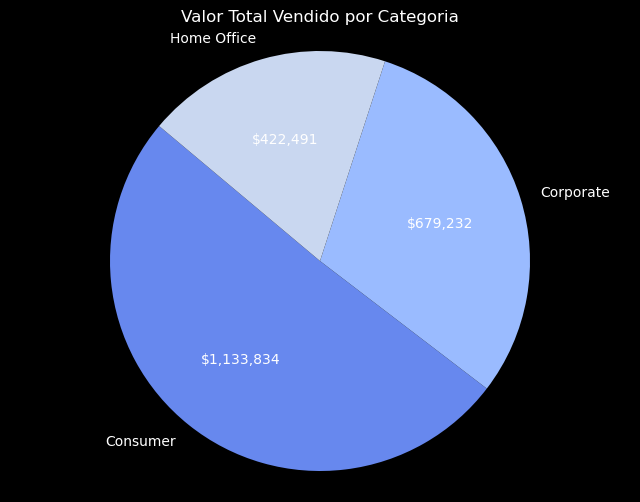
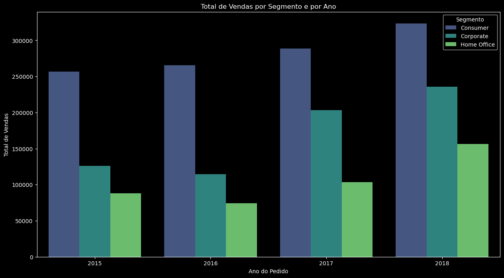
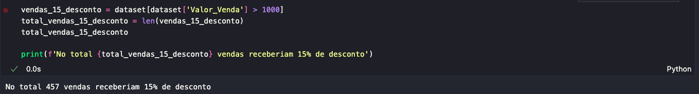
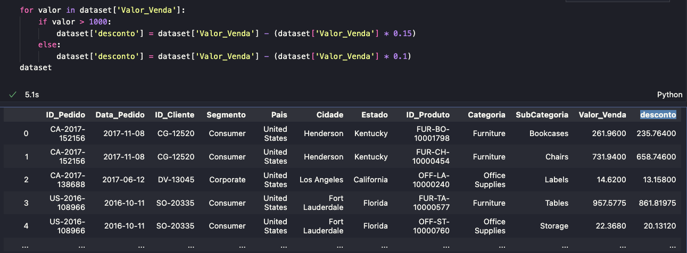

# Análise Exploratória

Projeto 2 do curso "Fundamentos de Linguagem Python para Análise de Dados e Data Science" da Data Science Academy.

## Introdução

A análise exploratória de dados (EDA) é uma abordagem utilizada para resumir as principais características de um conjunto de dados, frequentemente com o auxílio de métodos visuais. O objetivo da EDA é entender a estrutura dos dados, identificar padrões, detectar anomalias, testar hipóteses e verificar suposições. Esse processo é essencial para preparar os dados para modelagem e para obter insights valiosos que possam orientar decisões e estratégias.

Foram elaboradas 10 perguntas para a realização deste projeto. A seguir, exploraremos cada uma delas.

## Pacotes

| Bibliotecas         | Explicação                      |
|---------------------|---------------------------------|
| Numpy / Pandas      | Para a manipulação dos dados.   |
| Matplotlib / Seaborn| Para a criação dos gráficos.    |
| Datetime            | Para manipular colunas do tipo data. |
| Math                | Para arredondar valores.        |

## Base de Dados Utilizada

| Base de dados | Local                                    |
|---------------|------------------------------------------|
| Dataset       | [Clique aqui](/dataset.csv) |
| Código Jupyter Notebook | [Clique aqui](/varejo.ipynb) |

## Análise Exploratória

Agora, vamos explorar uma série de perguntas que guiarão nossa análise exploratória de dados, acompanhadas das respectivas respostas potenciais.

### 1 - Qual a cidade com maior valor de venda de produtos da categoria 'Office Supplies'?

### 2 - Qual o total de vendas por data do pedido?

O gráfico solicitado atende à questão específica, porém, para melhor legibilidade, poderíamos aplicar filtros adicionais. Neste caso, optei por filtrar os dados pelo mês.

### 3 - Qual o total de vendas por estado?

### 4 - Quais são as 10 cidades com maior total de vendas?

### 5 -  Qual segmento teve o maior total de vendas? Desmostre o resultado através de um gráfico de pizza.

### 6 - Qual o total de vendas por segmento e por ano?

## Pergunta de Negócio 7 (Desafio Nível Júnior):

Os  gestores  da  empresa  estão  considerando conceder  diferentes  faixas  de  descontos  e gostariam de fazer uma simulação com base na regra abaixo:

- Se o Valor_Venda for maior que 1000 recebe 15% de desconto.

- Se o Valor_Venda for menor que 1000 recebe 10% de desconto.Quantas Vendas Receberiam 15% de Desconto?

### Pergunta de Negócio 8 (Desafio Nível Master):

Considere  Que  a  Empresa  Decida  Conceder  o  Desconto  de  15%  do  Item  Anterior.  Qual Seria a Média do Valor de Venda Antes e Depois do Desconto?

